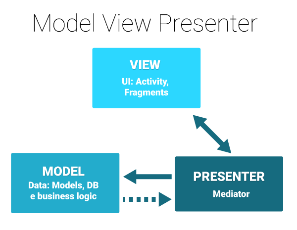

Teamwork Together
=======
###### ...For Teams that work together

APK Download
--------
[**Teamwork Together Apk**: (v1.0.0)](apk/Teamwork_Together_1.0.0.apk)

Info
--------
Teamwork Together Handcrafted remotely by Tunji Olu-Taiwo http://www.tunjos.co using <a href="https://www.teamwork.com/project-management-software" title="Teamwork Projects">Teamwork Projects</a>.
The Teamwork Logo is a property of <a href="https://www.teamwork.com/" title="Teamwork">Teamwork.com</a>
Social Icons made by <a href="http://www.freepik.com" title="Freepik">Freepik</a> from <a href="http://www.flaticon.com" title="Flaticon">www.flaticon.com</a> is licensed by <a href="http://creativecommons.org/licenses/by/3.0/" title="Creative Commons BY 3.0" target="_blank">CC 3.0 BY</a>

Screenshots
----------

![scr_1]![scr_2]![scr_3]
![scr_4]![scr_5]![scr_6]
![scr_7]![scr_8]

Architecture
----------
Teamwork Together is built using the MVP - Model View Presenter Pattern.

API's Used
----------

https://[your_site].teamwork.com/me.json  
https://[your_site].teamwork.com/projects.json  
https://[your_site].teamwork.com/projects/{project_id}/tasklists.json  
https://[your_site].teamwork.com/tasklists/{id}/tasks.json  

Configuring
--------

To configure the app credentials, open the **gradle.properties** file and fill in your <your_teamwork_site> and <api_token>.

    teamworkApiBaseUrl = <your_teamwork_site>
    teamworkApiToken = <api_token>

Building
--------

To build a debug version, run this from the root of the project:

    ./gradlew app:assembleDebug
A Debug .apk file will be created in the **app/build/outputs/apk/** folder.

Quality Control
-------

To run the unit tests:

	./gradlew app:testDebugUnitTest
Test Summary will be generated in the **app/build/reports/tests/testDebugUnitTest/index.html** file.

To run instrumentation tests:

	./gradlew app:connectedAndroidTest
Test Summary will be generated in the **app/build/reports/androidTests/connected/index.html** file.

  License
--------

    Copyright 2017 Tunji Olu-Taiwo

    Licensed under the Apache License, Version 2.0 (the "License");
    you may not use this file except in compliance with the License.
    You may obtain a copy of the License at

       http://www.apache.org/licenses/LICENSE-2.0

    Unless required by applicable law or agreed to in writing, software
    distributed under the License is distributed on an "AS IS" BASIS,
    WITHOUT WARRANTIES OR CONDITIONS OF ANY KIND, either express or implied.
    See the License for the specific language governing permissions and
    limitations under the License.

[scr_1]: screenshots/scr_nav.png
[scr_2]: screenshots/scr_projects.png
[scr_3]: screenshots/scr_tasklists.png
[scr_4]: screenshots/scr_products.png
[scr_5]: screenshots/scr_happiness.png
[scr_6]: screenshots/scr_team.png
[scr_7]: screenshots/scr_contact.png
[scr_8]: screenshots/scr_uptime.png
